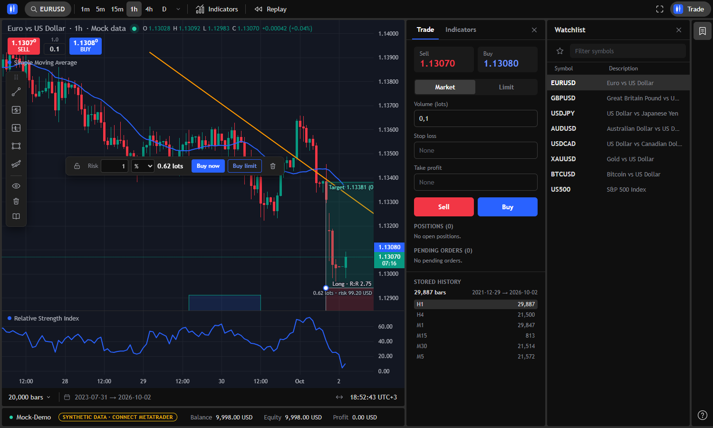
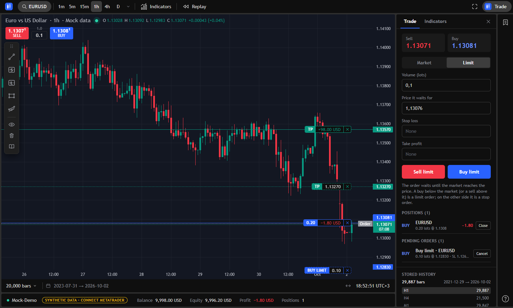
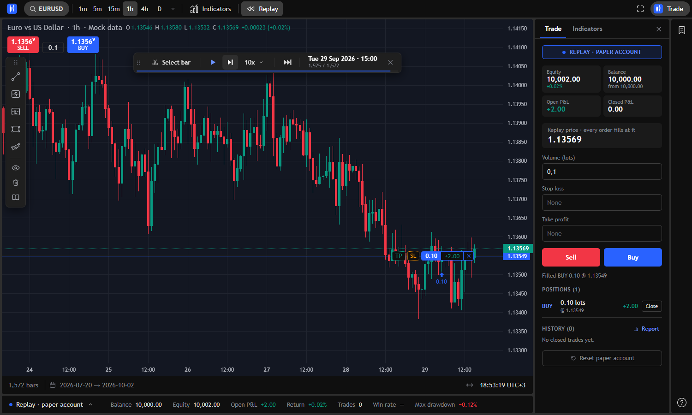
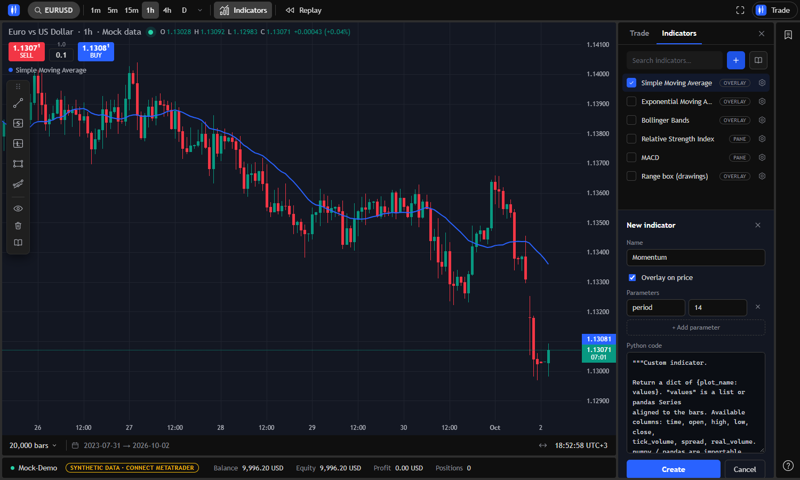
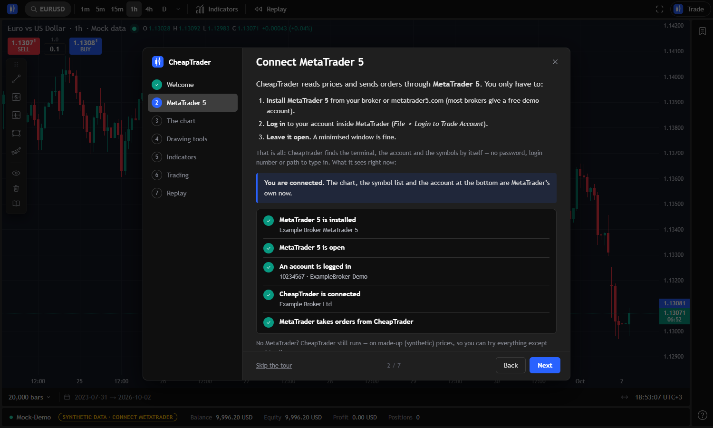

<p align="center">
  
</p>

# CheapTrader

**A free, TradingView-style trading platform for MetaTrader 5.** Live charts, drawing tools that can place
trades, indicators you write in Python, and bar replay with a paper account. For Windows. Open source (MIT).

**[Download](../../releases/latest)** &nbsp;·&nbsp; [Getting started](docs/GETTING_STARTED.md) &nbsp;·&nbsp;
[Indicator guide](docs/INDICATORS.md) &nbsp;·&nbsp; [Drawing guide](docs/DRAWINGS.md) &nbsp;·&nbsp;
[Changelog](CHANGELOG.md)

> **Risk warning.** Trading leveraged products carries a high risk of losing money. CheapTrader is provided
> "as is", without warranty, and is not financial advice. Try everything on a **demo account** first. Sending
> orders from the app is **switched off** until you switch it on yourself.

## What it does

* **Charts like TradingView's.** Live candlesticks from MetaTrader 5 (every tick, with the terminal's own highs
  and lows), all intervals, a watchlist of every symbol your broker offers, price tags, a right-click menu, a
  layout that is remembered.
* **Drawing tools.** Trend line, rectangle (extended to the right), parallel channel and long / short position
  boxes. They are saved per symbol, can be locked, removed for one symbol or all, and added from Python or a
  REST call.
* **Trade from the chart.** Market and limit / stop orders, stop loss and take profit that you drag into place,
  orders that wait shown on the chart. A long / short box can **buy or sell now** with its stop and target, leave
  a **limit order** at its entry, and size the trade by risk (a % of your balance, an amount, or lots).
* **Indicators in Python.** The usual ones are built in. Write your own as a small function
  (`compute(df, params)`), draw lines, panes and shapes, and run it in a sandbox.
* **Bar replay.** Practise on history with a paper account: stop loss / take profit, trade markers, an equity
  curve and statistics. Nothing reaches your broker.
* **Starts without MetaTrader.** On a synthetic market you can look around. Once a terminal is open and logged in,
  the welcome tour (or one click on the chip at the bottom) connects to it, without a restart.
* **Yours alone.** It runs on your PC and listens on `127.0.0.1` only. No account, no telemetry, nothing is
  sent anywhere.

| | |
| --- | --- |
|  |  |
| Orders and positions on the chart, a limit order waiting | Bar replay with a paper account |
|  |  |
| Your own indicator in Python | The welcome tour checks MetaTrader (a simulated terminal here) |

(The pictures show the built-in synthetic market, not real prices or a real account.)

## Install

You need Windows 10 or 11 (64-bit). For real prices and trading you also need **MetaTrader 5**:

1. Install MetaTrader 5 from your broker (or from metatrader5.com), **log in** to a trading account (a free demo
   account is perfect) and **leave it open**. A minimised window is fine.
2. Download `CheapTrader-<version>-setup.exe` (installer) or `CheapTrader-<version>-win64.zip` (portable: unzip
   anywhere, run `CheapTrader.exe`) from the **[latest release](../../releases/latest)**.
3. Run it. The welcome tour opens by itself and shows what CheapTrader sees of MetaTrader: installed? open? an
   account logged in? connected? There is no password, login number or path to type in.

Windows may say *"Windows protected your PC"* the first time: the program is not signed. Click **More info**,
then **Run anyway**. To check that your download is the one that was published, compare its checksum with
`SHA256SUMS.txt` on the release page: `Get-FileHash .\CheapTrader-<version>-setup.exe -Algorithm SHA256`.

More: **[Getting started](docs/GETTING_STARTED.md)** (including what to do when it does not connect).

## Safety

* **Orders are off in a fresh install.** Nothing can reach your broker until you turn on *Send orders to the
  broker* in the MetaTrader menu (bottom bar) and confirm. Do it on a demo account first. MetaTrader's own
  *Algo Trading* button must be green as well.
* The program listens on `127.0.0.1` only and refuses requests from other web pages and for other host names, so
  a website you visit cannot place an order through it.
* Indicators run in a sandbox with a time and memory limit.
* See [SECURITY.md](SECURITY.md) to report a vulnerability.

## Support the project

CheapTrader is free and made in spare time. If it is useful to you, a ⭐ on this page, a bug report, an idea or a
pull request (see [CONTRIBUTING.md](CONTRIBUTING.md)) helps most. Donation links, once the project has them, appear
as the **Sponsor** button of this repository and under *About & support* in the app.

## Licence and credits

CheapTrader is released under the [MIT licence](LICENSE). The charts are drawn by
[TradingView Lightweight Charts™](https://www.tradingview.com/lightweight-charts/) (Apache-2.0, Copyright (c)
TradingView, Inc.; see [NOTICE](NOTICE)). The other components are listed in [docs/CREDITS.md](docs/CREDITS.md).
MetaTrader 5 is a trademark of MetaQuotes Ltd. CheapTrader is an independent project and is **not affiliated
with, endorsed by or sponsored by MetaQuotes, TradingView or any broker**; the look of its interface is inspired
by TradingView's.

---

## For developers

Everything below is for people who want to understand or change the code: how the program is built, how to
run it from the source, how it is tested, and the history of how it got here.

## Status

**Phase 3 complete + UI refinement.** Live MVP, replay, on-chart trading, a
sandboxed Python indicator engine, and a TradingView-grade chart with
chart-only AI snapshots.

- Phase 1 — Live MT5 data, universal symbol sync, candlestick chart, tick
  streaming, account info, order placement.
- Phase 2 — Virtual-clock bar replay (play/pause/step/seek/speed), on-chart
  BUY/SELL buttons, draggable SL/TP price lines.
- Phase 3 — Sandboxed Python indicator engine (restricted imports, timeout,
  memory cap), indicator registry with 5 built-ins, and an in-app editor.
- Refinement — TradingView dark theme, live OHLC legend, redesigned indicator
  manager, and a **chart-only snapshot renderer** (multi-part, with
  symbol/timeframe/time-window metadata bound to each image).
- Refinement 2 — TradingView-style **bar replay** (click a starting bar → floating
  toolbar with play/pause, step, speed, jump-to-real-time, close), hideable
  panels, and pane indicators that render in their own sub-panes.
- Refinement 3 — **Paper trading inside replay** (buy/sell with SL/TP, live
  position tracking, SL/TP auto-fill, performance stats), plus a **persistent
  incremental bar store** that only fetches the data that is missing.
- Refinement 4 — **TradingView layout rebuild.** The whole shell was redrawn from
  measurements of a TradingView screenshot: panels float as `#0f0f0f` cards on a
  `#2e2e2e` canvas with 4px gutters and 4px corners, a single 38px header, a
  right-hand icon rail, the Sell / Buy pill with spread and lot size in the chart
  legend, TradingView's position tags riding the entry / SL / TP lines, the
  ask + last-price labels with a bar-close countdown on the price scale, and the
  range bar and account strip underneath. It is a presentation rebuild: nothing
  was added that the app cannot do — see "What is not drawn" below. The same
  pass fixed a number of bugs, listed under "Fixed in Refinement 4".
- Refinement 5 — **Seamless interval changes.** The chart never blanks, keeps your
  zoom and place, and opens on the newest 1,500 bars first (see "Changing the
  interval").
- Refinement 6 — **Replay rebuild.** One-click start with a cut line instead of a
  dialog, a draggable transport bar with exact speeds, browser-driven playback that
  stays smooth on year-long windows, trade markers, stop / target messages, a
  paper-account strip and a performance report with an equity curve (see "Replay").
- Refinement 7 — **A live feed that keeps up with MetaTrader.** Every tick reaches the
  screen (it used to be a sample of four a second), candles carry the terminal's own
  highs and lows, positions and the account are pushed instead of polled every five
  seconds, and neither a slow broker nor a busy terminal freezes the price any more:
  the server makes no MetaTrader call itself, and a dot says when MetaTrader is slow to
  answer (see "Keeping up with MetaTrader").
- Refinement 8 — **Drawing tools, documentation in the app, and panes that do not
  collide.** A floating bar with a trend line, short and long position boxes, a rectangle
  (extended to the right) and a parallel channel. Drawings are kept per symbol on the
  server, come back after a restart, and can also be added from a Python indicator or the
  REST API. The indicator and drawing guides open inside the app. Every oscillator now
  gets a pane of its own (two of them used to share one scale), with its legend at the
  top of it, and the pane sizes are remembered (see "Drawing tools" and "Indicator
  panes").
- Refinement 9 — **Limit and stop orders, trading from the position boxes, locks.**
  The order ticket gets a Limit tab (buy / sell limit, and stop orders when the price is
  on the other side of the market); waiting orders have their own lines and tags on the
  chart, can be dragged, cancelled and are listed in the Trade panel; the chart's
  right-click menu can place them. A long or short box can now buy or sell at the market
  with its own stop and target (even before the price reaches its entry), leave a limit
  order at its entry, put its levels on an open position, and size the trade by a share of
  the balance, an amount or lots. Any drawing can be locked (no moving, no deleting), and
  the bin offers removing the drawings of this symbol or of all symbols, and the locked
  ones separately (see "Orders that wait" and "Drawing tools").

## UI layout

```
┌ header ─ brand · symbol ⌕ │ 1m 5m 15m 1h 4h D ▾ │ Indicators │ Replay ….. ⛶ · Trade ┐
├──────────────────────────────────────────────┬───────────┬───────────┬──────┤
│ chart                                        │ dock      │ watchlist │ rail │
│  title · interval · source ●  O H L C chg    │ Trade /   │           │  ▤   │
│  [ SELL ] [ spread / lots ] [ BUY ]          │ Indicators│           │      │
│  a legend row per indicator on the candles   │           │           │      │
│        [TP][SL][ lots │ P/L │ ✕ ] ──  ask ▌  │           │           │      │
│                                     last ▌   │           │           │      │
├──────────────────────────────────────────────┤           │           │      │
│ 20,000 bars ▾ │ date range          ↔  clock │           │           │  ?   │
├──────────────────────────────────────────────┤           │           │      │
│ ● account  Balance  Equity  Profit  Positions│           │           │      │
└──────────────────────────────────────────────┴───────────┴───────────┴──────┘
```

There is deliberately **one control per function**:

| Function | The single control |
| --- | --- |
| show / hide the watchlist | the bookmark button on the right rail (or the ✕ in its header) |
| show / hide the side panel | the header **Trade** / **Indicators** buttons toggle their own tab; ✕ in the panel header |
| search / open a symbol | the header symbol button (opens the search overlay) |
| add the chart symbol to the list | the star in the watchlist toolbar |
| remove a list entry | that row's star |
| order ticket | the header **Trade** button |
| quick market orders | the **Sell / Buy** buttons in the chart legend |
| lot size | the box between Sell and Buy (the ticket edits the same value) |
| indicators | the header **Indicators** button; a legend row's gear opens the panel |
| draw on the chart | the floating **drawing bar** over the chart (drag its grip to move it) |
| read the documentation | the book buttons (drawing bar, Indicators panel) or **Documentation** in the `?` menu |
| bar replay | the header **Replay** button |
| history depth | the `N bars ▾` button in the range bar |
| fit chart | `F`, double-click the chart, the ↔ button in the range bar, or **Reset chart view** in the right-click menu |
| zoom / stretch | mouse wheel, or drag the price / time axis |
| copy a price | right-click the chart → **Copy price** (see "Right-click menu") |
| fullscreen | the header ⛶ button |
| keyboard help | the `?` button on the right rail |
| remove a drawing | select it, then **Del** (or the bin in the bar above it) |

**Selecting and adding are separate**, as in TradingView: picking a result in the
search overlay (or clicking a row) only opens that symbol on the chart. Nothing
enters the watchlist until you press a star. When the list is empty the panel
falls back to the broker's symbol table so it is never blank.

### What is not drawn

TradingView's chrome also has alerts, chart types, compare, layouts, snapshots, a data
window, screeners and more, and a drawing toolbox of dozens of tools. The app has none
of those features (its drawing tools are the five under "Drawing tools"), so none of
those buttons exist — no dead controls. If one of them is
built later, it gets its control then.

### Chart legend

`Euro vs US Dollar · 15 · MetaTrader 5 ●  O… H… L… C… +chg (+%)`

* The dot is green while fresh live ticks arrive and grey when they do not (a
  closed market streams a frozen last tick, which does not count).
* **Sell** shows the bid and **Buy** the ask; the last digit is raised like
  TradingView's fractional pip. The small number over the lot box is the live
  spread in pips. In a replay both buttons show the bar close, which is where
  paper orders fill.
* Every indicator drawn on the candles has a row under the buttons; an indicator
  with a pane of its own has its row at the top-left of that pane. The gear (on hover)
  opens the indicator panel. The old top-centre pills were a duplicate of this list
  and are gone.

### Price scale labels

The ask (blue) and the last price (green / red like the latest candle) sit on the
price scale, with the **time left in the current bar** under the last price. The
countdown uses the broker's own clock, learned from its ticks, so it is right even
though MetaTrader's bar times are server time. It is hidden in a replay and when
the market is closed.

### Position tags (SL / TP)

An open position always shows its **entry** line on the chart with TradingView's
tag riding it:

```
 ┄┄┄ [TP] [SL] [ 0.10 │ −0.42 USD │ ✕ ] ┄┄┄┄┄┄
```

* the lot size, the live profit or loss in the account currency, and a **✕ that
  closes the position**; the line and tag are blue for a buy and red for a sell;
* **`TP` / `SL`** (dotted) add a target / stop. **Drag one onto the chart and let
  go where the level should be**: a dashed ghost line follows the pointer with a
  tag showing what the level would cost or make and its price on the axis, and
  nothing is sent until you let go. **Click** it instead to put the level at a
  sensible distance, on the side the broker requires. Only the level you asked for
  is created. `Esc`, switching windows, or letting go off the chart cancels;
* every level that exists has its own line and tag — `SL` orange, `TP` green —
  showing what it would cost or make. **Drag the tag, or the line itself, up or
  down** to move it; the **✕** removes just that level. A plain click on a tag
  never changes anything;
* a level dragged or dropped on the wrong side of the entry is refused with a
  message naming the required side (while dragging a new one, the ghost is dimmed
  there); a moved level snaps straight back, a new one is simply not placed;
* only levels the broker actually holds are ever drawn, so the chart never shows a
  stop that does not exist. Levels live on the broker, so they survive a refresh;
* tags that would overlap are spread apart, and all of them follow the price scale
  while you zoom, pan or autoscale.

The dashed `SL` / `TP` lines you get from typing a price into the order ticket are
drafts: drag them to adjust the ticket's fields.

### Orders that wait (limit and stop orders)

The order ticket has **Market | Limit** tabs. On the Limit tab the ticket asks for the
price the order should wait at (it starts next to the market, and a grey dashed
"Order" line on the chart shows it: **drag the line to choose the price**), and its Sell
and Buy buttons name what the price makes of the order — a buy below the buy price
(or a sell above the sell price) is a **limit** order, on the other side of the market a
**stop** order. The stop loss and take profit fields go with it.

* A waiting order has a dashed line and a tag on the chart, in the colours of positions
  (`BUY LIMIT │ 0.10 │ ✕`, and `SL` / `TP` tags once it has them). **Drag the tag or
  the line** to move the price, stop or target; the **✕** takes the order back (or just
  that level). They are also listed under *Pending orders* in the Trade panel with a
  *Cancel* button.
* Prices are checked before anything is sent, with a sentence naming what is needed
  (`A buy limit has to be below the current buy price 1.13042`; the broker's minimum
  distance from the market is included). A drag that breaks a rule snaps back.
* The right-click menu on the chart offers **Buy limit / Sell stop … at this price** (and
  *Set stop loss here* for a waiting order), see below.
* When the market reaches an order the broker opens the position (its ticket is the
  order's), and a message says `Buy limit filled · bought 0.10 EURUSD at 1.12935`.
* Live trading only: a replay fills every paper order at the bar close, so it has no
  waiting orders. Orders are placed, moved and cancelled over `POST/PATCH/DELETE
  /api/orders` (`GET /api/orders` lists them); they go through the same trade process
  as market orders, and placing one is held back by `CT_ALLOW_LIVE_ORDERS` like any other
  order (moving or cancelling an order that exists is not, as with positions).

### Right-click menu

Right-clicking the chart opens TradingView's kind of menu instead of the browser's
("Save image as…", "Copy image", "Inspect"):

* **Copy price 1.13586** copies the price under the pointer (as the digits the
  chart shows) and confirms with a small "Copied …" message;
* for each open position, **Set / Move stop loss here** or **Set / Move take
  profit here** — only the one that is valid at that price is offered (a stop on
  the losing side of the entry, a target on the winning side), and with several
  positions open each entry names its side and lots;
* **Buy limit / Buy stop / Sell limit / Sell stop … lots at the price** — a waiting order at
  the price under the pointer with the ticket's lot size (limit or stop, whichever the
  price makes it; greyed out with the reason when it breaks a rule). Live trading only;
* for each order that waits, **Set / Move stop loss here** or **take profit here**;
* **Reset chart view** (`F`).

The price entries appear over the price pane only, not over the time axis or an
indicator's sub-pane. `Esc`, a click elsewhere, scrolling or resizing closes the
menu; the arrow keys move through it. Text fields keep the browser's own menu
(cut / copy / paste). It works the same in a replay, where the stop and target
changes go to the paper account.

### Drawing tools

A small bar floats over the chart (drag the dotted grip on top to move it; double-click
the grip to put it back). It starts just under the legend so the two never sit on each
other. Its tools are the ones in the TradingView toolbar the app was modelled on:

| Tool | Clicks | Notes |
| --- | --- | --- |
| Trend line | start, end | can be extended to the right |
| `S` Short position | one | stop above, target below, risk-to-reward shown |
| `L` Long position | one | stop below, target above |
| Rectangle | two corners | **extends to the right** by default |
| Parallel channel | base line (2), then width (1) | filled band, dashed middle line |

A tool stays armed until its drawing is finished or **Esc** is pressed; a line at the
bottom of the chart says what to click next and a preview follows the pointer. Click a
line (or inside a box) to select it: handles appear to move a point, a side or a whole
drawing, and a small bar above it sets the colour, the thickness, "extend to the right"
and deletes it. **Del** deletes the selected drawing. A small **padlock** in that bar
locks a drawing so it cannot be moved or deleted (see below), and **right-clicking** a
drawing opens its menu.

**Long and short boxes can place their trade.** Right-click one (or use the bar over it):

* **Buy / Sell *N* lots now** — an order at the market at once with the box's stop and target,
  *even if the price has not reached the entry line* between the green and the red part. When it
  is filled, the box's **middle (entry) line moves to the price the trade opened at** (its start to
  the candle it opened in); the stop and target stay, and a locked box stays as drawn;
* **Buy / Sell limit (or stop) at the entry** — leaves an order waiting at the box's entry
  (with its stop and target);
* **Set stop and target of the open buy / sell** — puts the box's levels on a position you
  already hold in the same direction;
* **position sizing** — the box has a *Risk* field in the bar (a share of the balance, an
  amount of money, or lots; 1 % of the balance by default) and prints the result under its
  title (`0.81 lots · risk 98.94 USD (0.99%)`). The lots come from the stop distance and the
  instrument's tick value, rounded down to the broker's volume step.

Nothing is sent unless one of those is chosen. Each entry says what it will send, a greyed-out
entry says why it cannot (a stop on the wrong side of the market, a price inside the broker's
minimum distance), and a message after it says what happened. A replay trades its paper account
the same way (market orders only).

**Locking.** A locked drawing has no handles, cannot be dragged, and refuses deleting (the key,
the bar, the menu, and `DELETE /api/drawings/{id}` → `423`); its colour, thickness, size and
orders can still be changed. The bin in the bar of tools opens a menu to remove drawings of
**this symbol** or **all symbols** (locked ones stay), or **only the locked ones** of either; each
line shows its count and asks twice.

* **Drawings are anchored to the market** — each point is a (time, price) — so they stay
  on the same candles when you pan, zoom or change the interval. A point past the newest
  candle is placed at the interval's pace, which is how a rectangle can reach into the
  future; the weekend gap has no width on the chart, so dragging a box across it follows
  the pointer instead of drifting by two days.
* **They are saved for you.** Each symbol's drawings are kept by the server in
  `data/drawings/<symbol>.json` (next to `CheapTrader.exe` for the Windows program), so
  they survive a restart and are the same in every browser tab. The eye in the bar hides
  them all (remembered); the bin opens the removal menu described above. Where the
  bar was left and the pane sizes are remembered by the browser.
* **Scripts can draw too.** `POST /api/drawings?symbol=EURUSD` adds a shape, and a chart
  that is open shows it at once (the server tells it over the live connection). A Python
  indicator can also return `"drawings"` from `compute` with the `ct_draw` helpers; those
  shapes belong to the indicator (read-only, gone when it is switched off). In a replay
  a shape from an indicator is shown only once the replay has reached all of it, so it
  cannot give the future away. Everything is described in
  [`docs/DRAWINGS.md`](docs/DRAWINGS.md), which also opens inside the app.
* The tools are paused while a replay start is being chosen (the click belongs to the
  replay), and the right-click menu is not offered over the bar.

### Indicator panes

Every indicator that is not an overlay gets a pane of its own under the candles, in the
order the indicators were added, with its name (and its settings gear) at the top-left of
the pane. Two oscillators therefore never share a scale — before, RSI (0–100) and MACD
(about 0.001) were both asked for "pane 1" and drawn together, which flattened one of
them. The `pane` number of an indicator no longer chooses a shared pane. The panes are
sized together so that they take at most 60% of the chart (but never less than 70 px each),
and the dividers can be dragged: the sizes you leave are remembered for the next time there are
as many panes.

### Changing the interval

Switching the interval, or coming back to a symbol you already had open, neither
blanks the chart nor throws your view away:

* **The chart never goes empty.** The candles on screen stay until the next ones
  are ready and are replaced in one frame — together with the interval named in the
  legend, the bar countdown and the live candle, so they never disagree. If the load
  takes longer than a moment the old candles dim and a thin bar sweeps along the top
  of the chart; they ease back in when the new ones land.
* **Your view comes with you.** Same zoom (the same number of candles across). If you
  were at the newest bar you stay there; if you had scrolled back to a date you stay
  on that date.
* **It is quick.** Only the newest 1,500 bars are requested first (more when you are
  zoomed far out or scrolled back, enough to reach where you were looking); the full
  history (the `N bars` setting) follows in the background and replaces them without
  anything on screen moving. Intervals you have opened are kept in memory (up to ten
  series), so going back is instant and only needs a small top-up request; pointing
  at an interval button starts loading it before you click.
* If a load fails the error is shown and the header goes back to the interval the
  chart is still on.
* A different symbol still starts from a clean chart, so the old symbol's candles
  never sit under the new name; it opens at the newest bars. Indicators keep their
  sub-panes in place and fill in once they are computed for the new interval — they
  are never drawn on the wrong bars.

### Keeping up with MetaTrader

The price, the candles, the open positions and the account follow the terminal as it
happens:

* **Every tick, not a sample.** The server used to look at the price four times a
  second and send whatever it saw, so in a fast market tick after tick never reached
  the screen and a candle's high and low missed the spikes. Measured against the
  terminal on XAUUSD (a quiet moment): 44% of the ticks lost, the rest a median 58 ms
  late (up to 240 ms). Now a feed asks the terminal for *all* the ticks since its last look (every
  5 ms) and sends them as they come, several at a time when the market is busy. The
  browser draws once per frame and folds every tick of the batch into the candle.
  Measured the same way: nothing lost, nothing twice, a median 2 ms behind the
  terminal (4 ms at the 90th percentile) up to the browser; on screen, within a frame
  or two of that.
* **The candle is the terminal's candle.** A finished candle has exactly the terminal's
  open, high, low and close. The newest few candles are read from the terminal again
  a moment after each new candle opens, when the tab comes back, after a reconnect
  and every 30 seconds, and where the page missed a tick (it was opened mid-candle,
  the connection dropped) the terminal's figure stands. Only those candles change, in
  place; nothing re-uploads and nothing moves.
* **Positions and the account are pushed.** A position opened, closed or changed in
  the terminal (by hand, an EA, the phone, a stop being hit) is on the chart within
  50–100 ms, a moved stop likewise, and the floating profit and the account strip
  follow every tick. They used to be read every 5 seconds. After a trade made here
  the feed is asked to look at once.
* **Nothing in the server waits for MetaTrader.** MetaTrader's Python package holds
  Python's global lock for the whole of every call: a thread that should wake every
  millisecond was measured frozen for exactly as long as each call took. A call that
  waits for the broker, such as an order (the demo's ping alone is about 110 ms), or for
  a terminal that is busy with someone else's work, freezes everything in the process
  that makes it: price and all. So the server makes no MetaTrader call at all. The live
  feed (`python -m app.stream.mt5_feed`), the reads — bars, symbols, the account, the
  positions — (`python -m app.broker.trade_worker --role reader`) and the orders
  (`--role trader`) each run in a process of their own, and the server only relays. A
  slow chart load does not stop the price (tested with a 3 s history read: no gap in the
  ticks over 54 ms, other requests answered in 6 ms), identical requests that arrive
  while one is on its way share its answer, and an order is never queued behind a read.
  A process that dies is started again by itself.
* **Instant answers to every click.** Buy and Sell show **SENDING…** the moment they
  are pressed (and cannot be pressed twice by accident); closing dims the tag and
  swaps its ✕ for a spinner; a stop you drop stays where you dropped it, dimmed, until
  the broker answers. A note then says what happened and how long the round trip took:
  *Bought 0.10 XAUUSD at 4169.52 · 131 ms*. The live feed no longer undoes a stop while
  you drag it.
* **Fast markets.** A market order the broker answers with a requote or "price changed"
  is asked again at the new price (three tries in all) instead of failing; the fill
  policy follows what each instrument accepts (IOC, else FOK); a stop or target not
  mentioned in a change is kept as it is, never removed by accident.
* **A symbol outside the Market Watch** is added to it when you open it, because the
  terminal sends no quotes for one that is not there.
* If the connection drops the live dot goes grey within seconds (not after half a
  minute), the page reconnects by itself and catches up; a chart that throws is built
  again instead of blanking the page.
* **A busy terminal is not a dead one.** MetaTrader serves every program that talks to
  it in turn. What slows it for the others is another program reading a lot of history
  through it: measured on this terminal, four programs reading half a day of ticks back
  to back made each call of this app wait about 12 ms instead of 0.03 ms, and a long
  download (the terminal fetching history from the broker) can make a call wait seconds
  (a new connection took twenty). A busy processor does not (24 busy processes: no
  change), and neither does another program connecting over and over. The feed's
  watchdog is patient about it — it restarts a feed that has exited or stayed silent for
  30 s (90 s while it is starting), backs off 0.5 s → 15 s between attempts, takes the
  whole process tree down when it does (on Windows a virtual environment's `python.exe`
  is only a launcher), and the feed itself rests as long as each look took, so it never
  uses more than about half of a slow terminal's time. Nothing is lost meanwhile: the
  ticks the terminal made are read when it answers. They arrive late and in bursts, and
  once the feed has been silent for 2.5 s the live dot turns **amber** (tooltip:
  "MetaTrader is slow to answer: prices are a few seconds late") and the server log says
  so; it goes green again by itself. If research or downloads run against the same
  MetaTrader you trade on, give them a terminal of their own (a second, portable
  install: `terminal64.exe /portable`). `GET /api/health` shows the feed's state
  (`feed`: `up`, `slow`, `restarting`, `down`), and the server log has one line per
  trade with the broker's and the whole call's time.

Settings (`backend/.env`): `CT_FEED_INTERVAL` (0.005 s) and `CT_STATE_INTERVAL`
(0.05 s) set how often the feed looks; `CT_MT5_ISOLATE=false` runs everything in one
process again (for debugging only); `CT_MOCK_TICK_RATE` and `CT_MOCK_VOLATILITY` make
the mock broker tick like a quiet afternoon or a news spike. `CT_TICK_POLL_INTERVAL` is
no longer used. The mock broker now has a real ticking market, positions marked to it
and stops / targets that close positions by themselves.

The stream (`/ws/stream`): the screen sends `{"type": "subscribe", "symbol": …}`; the
server pushes `ticks` (every tick since the last message, oldest first), `state` (the
positions and the account, whenever one changes), `feed` (the MetaTrader feed is
`up`, `slow`, `restarting` or `down`) and answers `ping` with `pong`.

### Replay

Replay walks the chart forward bar by bar from a moment in the past, with a paper
account to trade on. It is TradingView's "Bar replay": pick the bar to start on,
press play.

**Starting.** Click **Replay**. A small bar appears over the chart — the chart itself
stays fully visible — and a cut line follows the pointer over the candles, with the
bar's time and how many bars lie ahead of it; everything to the right is shaded.
Click a bar and the replay starts there. Or use the bar's one-click starts:
**1D 1W 1M 3M 1Y** (that far back from the newest bar), **Date** (an exact day, and
a time on intraday intervals) or **Random**. `Esc` cancels. Starts older than the
history already loaded on the chart are switched off, with a tooltip saying so — the
`N bars` setting at the bottom left decides how far back that is — and the date form
shows the range that is available. Because those bars are already stored, starting
never turns into a long download from the broker.

**Transport bar** (floating over the chart; drag its ⠿ grip to move it out of the
way of a position's TP / SL buttons, double-click the grip to put it back — the spot
is remembered):

| Control | Does |
| --- | --- |
| **Select bar** | choose another starting bar (the paper account starts over) |
| ▶ / ❚❚ (`Space`) | play / pause |
| ⏭ step (`→`) | forward one bar |
| **2x ▾** | speed in bars per second: 0.5, 1, 2, 5, 10, 25 or 50 (remembered) |
| ⏩ | jump to the last bar — stops and targets on the way are still honoured |
| clock | the cursor bar's time and `position / total` bars |
| ✕ (`Esc`) | leave the replay |

The thin line along its lower edge shows how far through the window the cursor is.
The chart opens at a readable zoom with the cursor near the right edge and follows
it as bars arrive; scroll or zoom whenever you like and it stays where you put it.
Changing the symbol or the interval ends the replay (as in TradingView). Indicators
are clipped at the cursor so they cannot show the future.

**The paper account.** Sell / Buy, the lot box, the ticket and the position tags
work exactly as in live trading, including dragging stops and targets, and every
order fills at the cursor bar's close. The balance starts at 10,000. The side panel
shows equity, balance, open and closed P&L, the open positions and a trade history
(**Reset paper account** asks twice). The strip under the chart follows it: balance,
equity, open P&L, return, trades (wins / losses), win rate, max drawdown and profit
factor — on a narrow window the last of these drop out whole rather than being cut
in half. When a stop or target closes a position — also during **Jump to the last bar** — a
message says which one and what it made. Entries are marked on the chart with an
arrow and the lots, exits with a dot and the profit or loss.

**Report.** The strip's name ("Replay · paper account") or the **Report** link in
the side panel opens a drawer above the strip:

* **Overview** — net profit, profit factor, win rate, trades (and win / loss
  streaks), max drawdown, average win, average loss (and win / loss ratio), best,
  worst and average trade (and how long they were held), beside an equity curve you
  can hover for any moment's equity.
* **Trades** — every closed trade, newest first: side, lots, when it opened and
  closed with the prices, how long it was held, its P&L, a running total, and how it
  ended (stop loss, take profit or closed by hand).

**Performance.** Playback is driven by the browser: at the chosen speed it asks the
backend (`POST /api/replay/advance`, at most ten times a second) for the next few
bars, and each reply carries everything the screen needs — the revealed bars, the
account, any trades a stop or target closed. Ten bars a second used to move 20–60 MB
in six seconds; it is now about 56 KB, with no long tasks in the browser, and a
year-long window (36,000 bars) plays as smoothly as a short one. The statistics
(drawdown, Sharpe, win/loss) are kept incrementally, so they cost the same on the
first bar as on the last.

Limits: paper P&L is in the instrument's quote currency and is not converted to the
account's currency (so a JPY pair reads in yen terms); and a replay only starts
inside the history loaded on the chart, as described above.

Fixed along the way:

* Setup was a two-step dialog (choose a window, **Apply dates**, then **Choose start
  point**) that covered the very chart the bar was to be picked from. It is the
  picker bar above now.
* The replay chart was squeezed: the whole window's bars shared the screen. It opens
  at a readable zoom on the cursor and follows it.
* Playback was timed by the server and every poll re-downloaded the visible bars, so
  fast speeds stalled. The browser now sets the pace, and the speeds are exact bars
  per second.
* Clicking **forward** (or pressing `→`) several times quickly moved one bar, because
  a click was ignored while the previous move was still on its way. Quick clicks
  and key presses are queued now, and so is **Jump to the last bar**.
* **Jump to the last bar** teleported past stops and targets, and a second press of
  play could start a second playback loop. Both are fixed; stepping back starts the
  paper account again instead of leaving trades from the "future" on it.
* A stop or target closing a position was silent, and the drawdown and win-rate
  figures were recomputed over the whole history on every poll.

Backend (`/api/replay`): `POST /start` (symbol, timeframe, time → opens a window of
1,500 bars before that bar and up to 60,000 after it), `POST /advance?delta=N`,
`GET /account`, `GET /report`, plus `state`, `bars`, `orders`, `positions`, `trades`
and `reset-account`. The older server-timed `play` / `pause` / `step` / `seek` /
`speed` routes remain for API users.

### Fixed in Refinement 4

Data (see "Data store" below):

* The mock broker's synthetic bars were being written into the same database file
  as real MT5 history (with `CT_BROKER=auto` the backend silently falls back to the
  mock when no terminal is running, and the test-suite used the real file too).
  That left 1,042 fake bars in the EURUSD H1 history — a six-week crash to 0.98
  followed by a jump back — right in the default view. The mock now has its own
  file, the tests never open a real data folder, and
  `backend/scripts/purge_mock_bars.py` removes what is already there.
* The store never caught up when it had been unused for a while, and never refilled
  a hole in the middle of a series. Both now heal themselves.
* The symbol list was silently capped at 500 entries.

Chart and trading:

* A new symbol now opens on the latest bars at a readable zoom (about 8 px per
  candle) instead of squeezing thousands of them into the window. `F` still fits
  everything that is loaded (and lets a price axis that was dragged out of range
  follow the candles again). Changing the interval keeps your zoom and place — see
  "Changing the interval".
* Changing the interval blanked the chart for as long as the download took (for a
  moment a lone candle on a collapsed price axis), reset the zoom and the scroll
  position, and let the legend, the countdown and the indicator lines run ahead of
  the candles. The whole switch now happens in one frame, from the cache when the
  interval has been seen before.
* The clock under the chart showed this machine's time labelled with a UTC offset,
  while the time axis is broker time. They now agree.
* Prices were rounded to 5 decimals whatever the symbol; a stop on gold or an index
  could be rejected as "Invalid stops". They are rounded to the symbol's digits.
* "The line was put back" after a refused drag of a line on the chart did not put
  it back (it restored the dragged value until the next poll). It does now.
* Orders refused by the broker failed silently from the chart buttons; closing from
  the panel had no error handling. Both report failures now.
* Dragging a stop no longer conjures a take-profit, and setting a stop no longer
  creates one either.
* Replay positions were never drawn on the chart and their stops could not be
  moved; they now use the same tags as live positions.
* Replay setup reported "Loaded 1 bars" for every window, and a bare end date
  excluded that whole day.
* The replay poll re-downloaded every bar, position and trade list every 400 ms
  even while paused; it now only does so when the cursor moves.
* Switching symbol quickly could show the previous symbol's bars; the Indicators
  tab did nothing during a replay; the watchlist filter missed mixed-case symbols
  (e.g. `Toyota`); the show-panel button used a padlock icon.
* The replay trade panel kept its own volume / SL / TP that disagreed with the
  chart buttons; they now share one set of values.
* Errors were shown as the raw reply, e.g. `403 Forbidden: {"detail":"Live orders
  are disabled…"}`, and a backend that was not running showed "Failed to fetch".
  They now read as plain sentences ("Live orders are disabled. Set
  CT_ALLOW_LIVE_ORDERS=true to enable." / "Cannot reach the CheapTrader backend…").

## Architecture

```
frontend/   React + TypeScript + Vite + lightweight-charts v5
backend/    FastAPI + WebSocket; broker adapters, cache, indicator engine,
            replay, backtest, snapshot renderer, MCP server
```

- **Broker abstraction** (`backend/app/broker/`): `MT5Adapter` (real) and
  `MockAdapter` (synthetic). Selection via `CT_BROKER=auto|mt5|mock`.
- **Data layer** (`backend/app/data/`): TTL cache, universal symbol registry and
  the persistent bar store.
- **API** (`backend/app/api/`): REST routes + the `/ws/stream` WebSocket.
- **Live feed** (`backend/app/stream/`): `FeedLoop` polls a `Source` for new ticks and
  for changes to the positions and the account; `Mt5Source` reads them from the
  terminal (all ticks since the last look, `copy_ticks_from`), run in its own process by
  `ProcessFeed` (`mt5_feed.py`); the mock broker's feed runs on a thread. `MarketHub`
  fans the events out to the connected screens, merging what a slow screen has not
  taken yet. `broker/isolated.py` + `broker/trade_worker.py` make every other call to
  MetaTrader in two processes of their own — the *reader* (bars, symbols, ticks, the
  account, the positions) and the *trader* (orders) — so the server itself makes none.
- **Frontend shell** (`frontend/src/components/`): `TopNav` (header), `RightRail`,
  `Dock` (Trade / Indicators panel), `RightPanel` (watchlist), `BottomToolbar`
  (range bar) and `AccountStrip` make up the chrome. The chart is `Chart` plus the
  DOM overlays that sit on it: `ChartLegend`, `PriceTags`, `PositionOverlay`,
  `ReplayPicker` and `ReplayCut` (choosing the start bar) or `ReplayToolbar`
  (the transport bar), and `ReplayReport` (the drawer above the strip, with
  `EquityChart`). `OrderPanel`, `ReplayTradePanel` (both built on `OrderTicket`),
  `IndicatorManager` and `DataCoverage` fill the dock. `lib/useReplay.ts` runs a
  replay (start, playback, the paper account) and `lib/replayMarkers.ts` turns its
  trades into chart marks.
- **What the chart shows is one `frame`** (`frontend/src/lib/useChartData.ts`): the
  candles, the symbol and interval they belong to, and what to do with the view when
  they arrive (`latest`, `anchor`, `keep` or `none` — see `ViewPolicy` in
  `lib/chart.ts`). `lib/barStore.ts` holds the in-memory series and the merge /
  sizing helpers, `lib/liveBar.ts` folds ticks into the newest candle, and the
  legend, countdown and live candle all read the frame on screen, never the
  interval just clicked. `lib/useLiveFeed.ts` hands React the stream once per
  animation frame (all the ticks of that frame), and `useChartData`'s `syncTail`
  checks the newest candles against the terminal's.
- **Drawings.** `backend/app/drawings.py` holds the model (a drawing has a type, (time,
  price) points and a style) and the per-symbol JSON store; `api/drawing_routes.py` is the
  REST surface and announces every change on the live connection; the indicator sandbox
  (`indicators/_runner.py`, `sandbox.py`) lets an indicator return shapes through a
  `ct_draw` helper module. On the page, `lib/drawings.ts` is pure arithmetic (what a
  drawing is laid out as, what dragging a handle does), `lib/useDrawings.ts` loads and saves
  them without making the chart wait, `components/DrawingLayer.tsx` is the SVG sheet over the
  candles plus the controller, and `DrawingToolbar.tsx` is the bar. The geometry in
  `lib/chart.ts` converts time and price to pixels in both directions, between bars too (the
  chart library only answers for whole bars).
- **Documentation in the app.** `api/docs_routes.py` serves `docs/*.md` (bundled into the
  exe); `lib/markdown.ts` reads them into plain data and `components/Markdown.tsx` +
  `DocsDialog.tsx` show them, with a table of contents and working links between pages.
- **Overlays follow the real price scale.** `PriceTags` and `PositionOverlay` read
  the chart's price → pixel mapping (`lib/chart.ts` → `geometry`) on every
  animation frame, so they stay glued to their prices during any pan, zoom or
  autoscale without causing React renders.
- **Theme.** All colours, sizes and radii live at the top of
  `frontend/src/styles.css`.
- **First start and connecting.** `components/WelcomeTour.tsx` opens the first time the app is
  started (`tourSeen` in the browser's storage) and from the `?` menu; its MetaTrader step shows
  `GET /api/terminal` as a checklist (`lib/tour.ts`: installed? open? account? connected?). The app begins on
  the mock market when no terminal is ready (`CT_BROKER=auto`); `POST /api/terminal/connect` then does what
  startup would have done (`AppState.prepare_metatrader` in a thread, `commit_metatrader` on the event loop:
  new adapter, bar store, symbols, and `MarketHub.swap_feed` so the open screens stay connected) and the page
  reloads and comes back to the tour. `components/AboutDialog.tsx` carries the credits the licences ask for;
  the project's links (repository, donation pages) are in `frontend/src/lib/project.ts`: an empty address is
  not shown.
- **Local only.** `app/security.py` is the outermost middleware (see Safety).

## Quick start

### Backend

```powershell
cd backend
uv sync --extra mt5 --extra dev
uv run uvicorn app.main:app --reload --port 8000
```

- API docs: http://localhost:8000/docs
- Health: http://localhost:8000/api/health

### Frontend

```powershell
cd frontend
npm install
npm run dev
```

Open http://localhost:5173.

### Windows program (`CheapTrader.exe`)

The whole app — page, API, live stream and the MetaTrader helper processes — can be built
into one Windows program that needs no Python, Node or terminal:

```powershell
cd backend
uv sync --extra mt5 --extra dev --extra build        # once (the "build" extra is PyInstaller)
uv run python scripts/build_exe.py --onefile         # -> release\CheapTrader.exe, about 1 minute
```

`--onefile` makes the single 58 MB exe; without it you get a folder
`release\CheapTrader\` that starts faster because nothing has to be unpacked. `--skip-ui`
reuses the existing `frontend/dist` instead of building the page again.

- **Using it.** Double-click `CheapTrader.exe`. MetaTrader 5 must be installed and logged
  in (the program starts the terminal if it is not running). The app opens in a window of
  its own (Edge in "app" mode: no tabs, no address bar, so the address is in the title bar:
  `CheapTrader · 127.0.0.1:8765`); closing that window stops everything, including the
  helper processes, a few seconds later and without asking. The program finds its window on
  the desktop by that title, so it does not matter how Edge was started. A second
  double-click just opens another window onto the running copy. It serves on
  `127.0.0.1:8765` (this PC only; `CT_PORT` changes it), so it does not clash with the
  development servers on 8000 / 5173. The **MetaTrader** menu in the account bar can also
  quit it (see below); that is the only way when neither Edge nor Chrome is installed and
  the page opens in the default browser instead.
- **Settings** are in `.env` next to the exe. The build writes it once, copying only
  `CT_BROKER` and `CT_ALLOW_LIVE_ORDERS` from `backend/.env` (nothing else: that file may
  hold a login), so with `CT_ALLOW_LIVE_ORDERS=true` the BUY and SELL buttons trade the
  logged-in account for real, exactly as in development.
- **Files** it keeps are in a `data` folder next to the exe: the bar store (`bars.db`; copy
  `backend/data/bars.db` there to keep the cached history), your indicators, the logs
  (`logs/cheaptrader.log`, and `logs/workers.log` for the helpers) and the small browser
  profile of the window (about 25 MB). `CT_DATA_DIR` puts the folder elsewhere; if the
  exe's folder is not writable it falls back to `%LOCALAPPDATA%\CheapTrader\data`.
- **Start-up.** A single-file exe unpacks about 100 MB into a temporary folder on every
  start: the very first start can take up to a minute (Windows scans the new files), later
  ones take 8–13 s. Do not replace or move the exe while it runs. `--no-window` serves
  without a window, `--console` also shows the log in a console.
- Windows SmartScreen or an antivirus may warn about it: it is an unsigned program built
  with PyInstaller.

How it works: `backend/launcher.py` is the entry point and `app/desktop.py` starts the
server and the window. The same exe is also its own helpers — the live feed and the
MetaTrader reader / trader (`CheapTrader.exe --worker app.stream.mt5_feed …`) and the
indicator sandbox (`--script …`), see `app/procutil.py` — and `app/paths.py` decides where
files live (next to the code while developing, next to the exe once built). With
`CT_UI_DIR=frontend\dist` a development backend also serves the page itself.

### The MetaTrader terminal, and letting the app trade

The **MetaTrader** button at the right end of the account bar (it carries an amber dot when
something stops the terminal taking the app's orders) opens one panel:

- **Which terminal.** Every broker ships its own copy of MetaTrader 5 (`C:\Program Files\Fusion
  Markets MetaTrader 5`, `...\IC Markets MetaTrader 5`). The app finds them itself — in the
  usual install folders and through MetaTrader's own list in `%APPDATA%\MetaQuotes\Terminal` —
  and connects to: the one named by `CT_MT5_PATH`; else the one you picked in this panel
  (**Terminals on this PC**, shown when there is more than one; used the next time the app
  starts); else a running one (with several running: the one for the broker `CT_MT5_SERVER`
  names, else the newest); else the one used last. `CT_MT5_AUTODETECT=false` turns the search
  off and leaves it to MetaTrader's Python package. The panel shows the broker, the account and
  the folder in use. Because quotes and the server clock differ between brokers, each broker
  gets its own bar store: the first one keeps `bars.db` (its name is written in `bars.db.broker`),
  the next gets `bars.<broker>.db`.
- **Hide the MetaTrader window.** A switch that hides the terminal's window (and its taskbar
  button) while the app runs. The terminal keeps running and so do the app and its orders; the
  switch shows it again. The choice is remembered in `preferences.json` in the data folder and
  applied at every start, also to a window that appears a little later (the terminal was
  started after the app). A window you bring back by hand is left alone until you flip the
  switch.
- **Algo trading.** The app trades through MetaTrader's Python interface, and the terminal only
  accepts such orders while its **Algo Trading** switch is on. The panel shows whether it is,
  and lists anything else that stops orders. What to switch on in MetaTrader:
  1. In the terminal's toolbar click **Algo Trading** so that it turns **green**. (Or: Tools →
     Options → Expert Advisors → tick **Allow algorithmic trading**.)
  2. Be logged in to the account with its **trading password** — an investor (read-only)
     password can look but not trade.
  3. Nothing else: no Expert Advisor has to run and "Allow DLL imports" is not needed.
  4. If orders are still refused, the broker has switched off automated trading for the
     account. A refused order says which of these it is (retcodes 10027 and 10026).
- **This page / Quit.** The address the app is open at, with a Copy button, and (in
  `CheapTrader.exe`) a two-click Quit button. Quitting leaves positions open in MetaTrader.

Endpoints behind it: `GET /api/terminal`, `POST /api/terminal/window {hidden}`,
`POST /api/terminal/choose {path}`, `POST /api/app/quit`.

## Configuration

Copy `backend/.env.example` to `backend/.env` and adjust. Key settings:

| Variable | Default | Purpose |
| --- | --- | --- |
| `CT_BROKER` | `auto` | `auto` tries MT5 then falls back to mock |
| `CT_ALLOW_LIVE_ORDERS` | `false` | Must be `true` to place real MT5 orders |
| `CT_FEED_INTERVAL` | `0.005` | How often the live feed looks for new ticks (seconds) |
| `CT_STATE_INTERVAL` | `0.05` | How often it looks for a change to the positions / account |
| `CT_MT5_ISOLATE` | `true` | Run the MetaTrader feed and trading calls in their own processes |
| `CT_MT5_PATH` | (found) | `terminal64.exe` to use; unset, the app looks for the terminal (below) |
| `CT_MT5_AUTODETECT` | `true` | Look for the installed / running MetaTrader terminals and pick one |
| `CT_MOCK_TICK_RATE` / `CT_MOCK_VOLATILITY` | `8` / `1` | Mock broker only: ticks a second, how wildly it moves |

`backend/.env` in this checkout has **`CT_ALLOW_LIVE_ORDERS=true`**, so the BUY
and SELL buttons send real orders to the logged-in account. Set it to `false`
to go back to paper-only behaviour. Do not blank the optional `CT_MT5_*` keys —
`CT_MT5_LOGIN` is typed `int | None` and an empty value fails validation at
startup; comment them out instead.

It also has **`CT_BROKER=mt5`**: the backend refuses to start when the MetaTrader
terminal is not running, instead of silently falling back to simulated prices as
the `auto` default does. Set it back to `auto` to allow the fallback; the account
bar then shows a gold **SYNTHETIC DATA** badge so made-up prices are never
mistaken for the market.

## Data store

Historical bars are cached in a local SQLite database. Requests only fetch what
is missing:

- **Latest N bars** — served from the DB. The broker's newest bars are always
  re-read, which also shows how far behind the store is, and anything in between
  is fetched; so a store that has sat unused catches up instead of serving an old
  tail. Older history is paged in backwards only if fewer than N bars are stored.
- **Holes** — a stretch with no bars at all longer than 6 days (intraday), 14 days
  (daily) or 8 weeks (weekly) is fetched from the broker, once per run. Weekends
  and holiday closures are far shorter and never trigger it.
- **Date range** — fetched only when the requested window is not already covered.

Each data source has its own file in `backend/data/`: **`bars.db`** for MetaTrader
5 and **`bars.mock.db`** for the mock broker, so synthetic candles can never end
up in real history. Inspect coverage at `GET /api/data/stats`.

### Cleaning an existing `bars.db`

If `bars.db` was written to by the mock before this change (it shows up as a
stretch of impossible prices, such as EURUSD crashing to 0.98 over six weeks),
remove the fake bars with the cleanup script. They are recognisable because a
broker's intraday bars always open on the timeframe grid and the mock's did not.
Stop the backend first, then:

```powershell
cd backend
uv run python scripts/purge_mock_bars.py            # report only, changes nothing
uv run python scripts/purge_mock_bars.py --apply    # back up to bars.db.bak-<time>, then delete
```

The next time that chart is opened the gap is refilled from MetaTrader
automatically (the terminal must be running).

This checkout was cleaned on 2026-10-01 (1,042 bars removed, 718 real bars refilled
and checked bar-for-bar against the terminal). The backup it made is
`backend/data/bars.db.bak-20261001-133445` (about 100 MB); delete it once you are
happy with the charts, or copy it over `bars.db` to undo.

## Documentation

- [`docs/INDICATORS.md`](docs/INDICATORS.md) — complete indicator-authoring
  reference (contract, return formats, overlay vs. pane, libraries, limits,
  recipes, and the MCP/REST workflow).
- [`docs/DRAWINGS.md`](docs/DRAWINGS.md) — the drawing tools, the shape format, drawing
  from a Python indicator (`ct_draw`) or the REST API, recipes.

Both open inside the app (the book buttons, or **Documentation** in the `?` menu). The
tests run every Python example in them and check every link.

## Orders and safety (developer notes)

Orders from the app are **off by default**: `CT_ALLOW_LIVE_ORDERS` is false and a fresh install has the switch
off. The user turns them on in the MetaTrader menu (remembered in `preferences.json`), or the settings file does
(`CT_ALLOW_LIVE_ORDERS=true`, which then cannot be switched off from the app). `scripts/build_exe.py --public`
builds the program for other people with `CT_BROKER=auto` and orders off, whatever `backend/.env` says; without
`--public` the two switches are copied from `backend/.env`, which is right for the build you run yourself.

The server answers only requests for `127.0.0.1` / `localhost` and refuses state-changing requests and
WebSocket connections that carry another site's `Origin` (`app/security.py`), so a web page cannot use the
program as an order gateway. `CT_ALLOWED_HOSTS` and `CT_ALLOWED_ORIGINS` add exceptions for development.

## Tests

```powershell
cd backend
uv run pytest
```

The page's pure logic (drawing layout and dragging, order rules and position sizing, the
Markdown reader) has its own tests:

```powershell
cd frontend
npm test
```

The backend suite never touches `backend/data`: a fixture points every test at a temporary
folder. The live feed is tested at three levels: the loop and the hub with fake sources,
the WebSocket end to end on the mock broker, and the real feed, reading and trading
*processes* against a stand-in `MetaTrader5` package (`tests/fake_mt5`) — including that
the price keeps moving while an order or a slow chart read waits for the terminal, and
that a feed starved by a busy terminal is called slow, not dead.

## Roadmap

- [x] Phase 1 — Scaffold, broker abstraction, symbol sync, live chart
- [x] Phase 2 — Replay mode, on-chart trading, drag-drop SL/TP
- [x] Phase 3 — Python indicator engine (sandbox) + manager UI
- [ ] Phase 4 — Backtesting engine + UI
- [ ] Phase 5 — MCP server, AI indicator injection, smart snapshots
- [ ] Phase 6 — Visual AI optimization loop + polish
